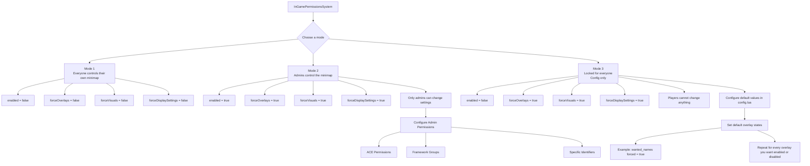

# Admin System

The script includes an advanced in-game permission system with **three different modes**, allowing you to decide how much control players have over their minimap.






Everyone controls thier own minimap


```lua
  InGamePermissionsSystem = {
    enabled = false,
    forceOverlays = false,
    forceVisuals = false,
    forceDisplaySettings = false,
    ace = { 'group.admin', 'fst_minimap.admin' },
    identifiers = { 'discord:907923629226983425', 'license:xxxx' },
    framework = { esx = { 'superadmin', 'admin' }, qbcore = { 'god', 'admin' }, qbox = { 'god', 'admin' } },
  },
```




Amins control the minimap including (Overlays, Visuals and Display Settings)


```lua
  InGamePermissionsSystem = {
    enabled = true,
    forceOverlays = true,
    forceVisuals = true,
    forceDisplaySettings = true,
    ace = { 'group.admin', 'fst_minimap.admin' },
    identifiers = { 'discord:907923629226983425', 'license:xxxx' },
    framework = { esx = { 'superadmin', 'admin' }, qbcore = { 'god', 'admin' }, qbox = { 'god', 'admin' } },
  },
```




Locked for everyone, Config only


```lua
  InGamePermissionsSystem = {
    enabled = false,
    forceOverlays = true,
    forceVisuals = true,
    forceDisplaySettings = true,
    ace = { 'group.admin', 'fst_minimap.admin' },
    identifiers = { 'discord:907923629226983425', 'license:xxxx' },
    framework = { esx = { 'superadmin', 'admin' }, qbcore = { 'god', 'admin' }, qbox = { 'god', 'admin' } },
  },
```




### Admin Permissions

You can define who has access to the admin controls using **ACE permissions**, **specific player identifiers**, or your framework's admin groups.<br>

```lua
ace = {
    'group.admin',
    'fst_minimap.admin'
},

identifiers = {
    'discord:xxxx',
    'license:xxxx'
},

framework = {
    esx = { 'superadmin', 'admin' },
    qbcore = { 'god', 'admin' },
    qbox = { 'god', 'admin' }
},
```



