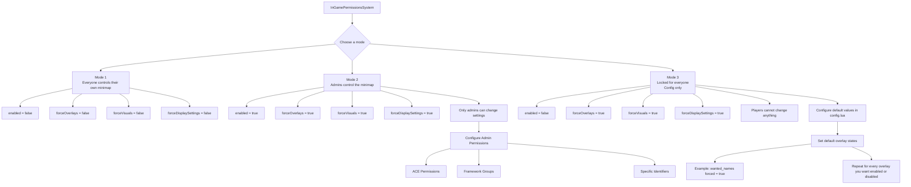

# Admin System





```lua
  InGamePermissionsSystem = {
    enabled = false,
    forceOverlays = false,
    forceVisuals = false,
    forceDisplaySettings = false,
    ace = { 'group.admin', 'fst_minimap.admin' },
    identifiers = { 'discord:907923629226983425', 'license:f21b66842de05a850df9224665256b1293ddfdc0' },
    framework = { esx = { 'superadmin', 'admin' }, qbcore = { 'god', 'admin' }, qbox = { 'god', 'admin' } },
  },
```



```lua
  InGamePermissionsSystem = {
    enabled = true,
    forceOverlays = true,
    forceVisuals = true,
    forceDisplaySettings = false,
    ace = { 'group.admin', 'fst_minimap.admin' },
    identifiers = { 'discord:907923629226983425', 'license:f21b66842de05a850df9224665256b1293ddfdc0' },
    framework = { esx = { 'superadmin', 'admin' }, qbcore = { 'god', 'admin' }, qbox = { 'god', 'admin' } },
  },
```



```lua
  InGamePermissionsSystem = {
    enabled = false,
    forceOverlays = true,
    forceVisuals = true,
    forceDisplaySettings = true,
    ace = { 'group.admin', 'fst_minimap.admin' },
    identifiers = { 'discord:907923629226983425', 'license:f21b66842de05a850df9224665256b1293ddfdc0' },
    framework = { esx = { 'superadmin', 'admin' }, qbcore = { 'god', 'admin' }, qbox = { 'god', 'admin' } },
  },
```


