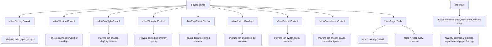
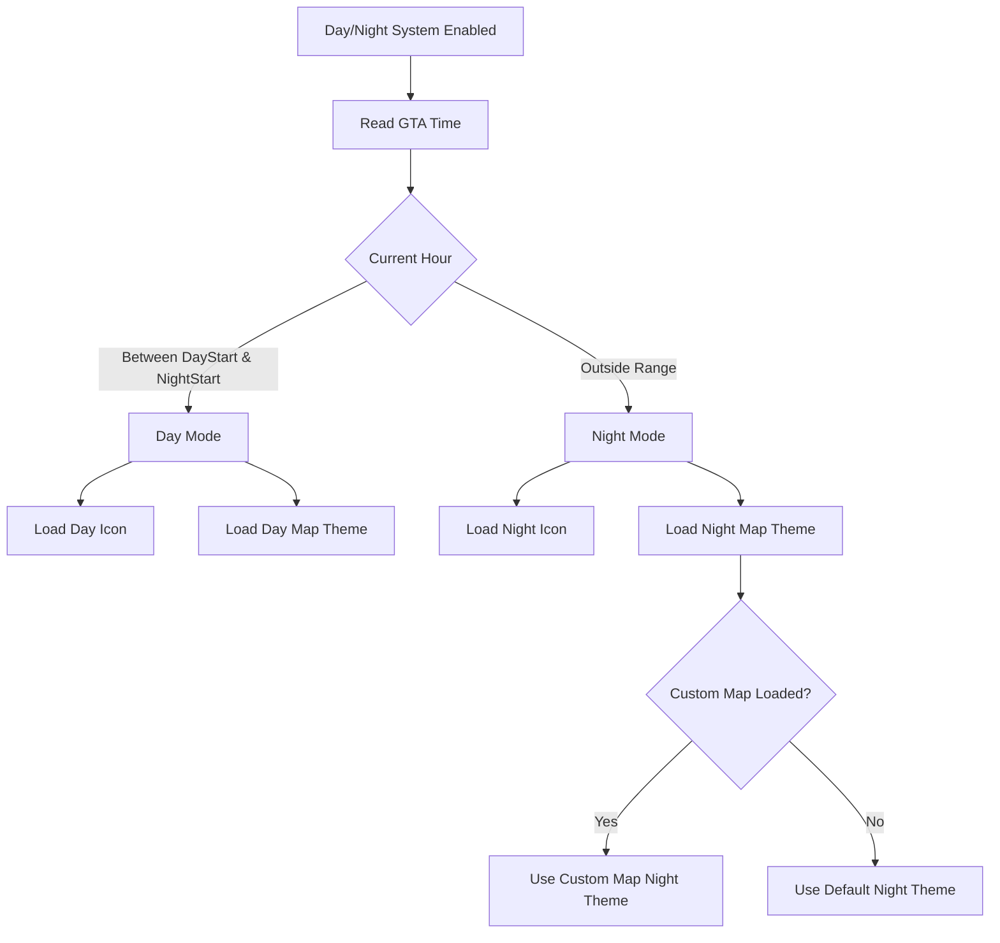
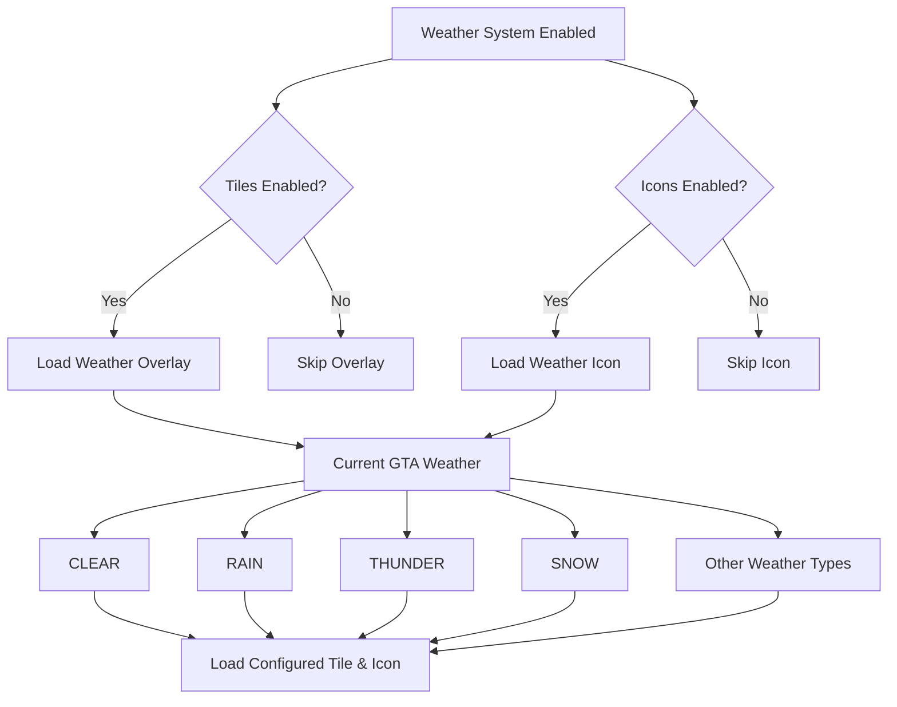

# More Systems

<details>

<summary>Player Preferences</summary>


Controls what features players can access from the tablet and whether their choices are saved.





```lua
  -- Player display preferences — controls what players can toggle and whether their settings are persisted
  playerSettings = {
    allowOverlayControl   = true, -- false = only server-forced overlays load, players cannot toggle anything
    allowWeatherControl   = true, -- allow players to toggle weather tiles / icons
    allowDayNightControl  = true, -- allow players to toggle day/night icon and map theme (also saves their preference)
    allowTileAlphaControl = true, -- allow players to use per-overlay / per-category opacity sliders
    allowMapThemeControl  = true, -- allow players to choose a base coloured map theme
    allowLinkedOverlays   = true, -- allow players to toggle the linked-overlay auto-sync feature
    allowDatasetControl   = true, -- allow players to switch postal code type (ocrp / standard / oulsen)
    allowPauseMenuControl = true, -- allow players to change the pause menu background from the tablet
    savePlayerPrefs       = true, -- false = disable per-player persistent settings (KVP) entirely
  },
```


</details>

<details>

<summary>Day / Night System</summary>


Automatically switches minimap themes and icons based on the current in-game time.




#### Configuration

`enabled`

* `true` → Automatically switches between Day and Night.
* `false` → Completely disables the system.

`dayStart`

Hour when daytime begins.

Default:

```
dayStart = 6
```

`nightStart`

Hour when nighttime begins.

Default:

```
nightStart = 21
```

***

#### Day Settings

```
day = {    tile = "DAY_ICON",    label = "Day",    mapTheme = nil}
```

* `tile` → Day icon.
* `label` → Name shown in the tablet.
* `mapTheme` → Optional daytime minimap theme.

***

#### Night Settings

```
night = {    tile = "NIGHT_ICON",    label = "Night",    mapTheme = "NIGHT_MAP"}
```

* `tile` → Night icon.
* `label` → Name shown in the tablet.
* `mapTheme` → Night minimap theme.

***

#### Custom Map Themes

Each custom map can have its own independent day/night theme.

Example:

```
customMapThemes = {    cayo_perico = {        day = nil,        night = "NIGHT_CAYO"    }}
```

This overrides only the selected custom map while leaving the default GTA map unchanged.

</details>

<details>

<summary>Weather System</summary>


Automatically displays weather overlays and weather icons based on the current in-game weather. The script detects GTA's current weather type and loads the matching overlay and/or icon automatically. Everything is fully configurable, allowing you to enable or disable the entire system or individual weather types.




#### Configuration

`enabled.tiles`

* `true` → Shows full weather overlays (rain, snow, clouds...)
* `false` → Disables weather overlays

`enabled.icons`

* `true` → Shows the weather icon on the minimap
* `false` → Disables weather icons

If **both** are disabled, the Weather System is completely disabled and no weather controls will appear in-game.

***

#### Weather Definitions

Each weather entry contains:

* `enabled` → Enables or disables that specific weather type.
* `tile` → The overlay texture to load.
* `icon` → The minimap weather icon.
* `label` → Name displayed inside the tablet.

Example:

```
RAIN = {    enabled = true,    tile = "RAIN",    icon = "RAIN_LOGO",    label = "Rain"}
```

If `enabled = false`, that weather will simply be ignored.

</details>

<details>

<summary>Default Conflict Groups</summary>

Each entry is a list of overlay style keys that cannot be active at the same time.


**here only one postal type can be active so if your trying to enable x postals the y will be disabled**

```lua
   {
      "p4d_dark", "p4d_light",
      "pocrp_dark", "pocrp_light",
    },
```


```lua
  OverlayConflictGroups = {
    { "interstates", "interstates2", "interstates_medieval", "interstates_nostalgic", "interstates_underwater" },
    { "rural",       "rural2",       "rural_medieval",       "rural_nostalgic",       "rural_underwater" },
    { "urban",       "urban2",       "urban_medieval",       "urban_nostalgic",       "urban_underwater" },
    -- Only one postal overlay can be active at a time across all postal subcategories
    {
      "p4d_dark", "p4d_light",
      "pocrp_dark", "pocrp_light",
    },
    { "western_map_key", "oldpaper_map_key" },
    { "western_poi",     "oldpaper_poi" },
    { "western_routes",  "oldpaper_routes" },
  },
```

</details>

<details>

<summary>Categories &#x26; Overlays System</summary>

The minimap uses a **category-based overlay system**. Categories organize overlays into logical groups in the tablet UI, and overlays are the actual map tiles that get rendered.

### How It Works

* **Categories** = Sections in the tablet UI (e.g., "Department Zones", "Postal Codes", "Map Themes")
* **Overlays** = Individual map tiles inside those sections (e.g., "LSPD", "Dark Postals", "Blue Ocean Theme")
* Each overlay belongs to one category via the `categorie` field
* Categories can have subcategories (nested tabs in the UI)

### Category Configuration

Each category supports these properties:

```lua
category_name = {
  enabled = true,              -- false = hide entire category from UI
  label = "Display Name",      -- What shows in the tablet
  description = "Details",     -- Subtitle/description text
  icon = "fa-solid fa-icon",   -- FontAwesome icon
  allowMultiple = false,       -- true = players can enable multiple overlays in this category
  
  -- Optional properties:
  subCategorie = true,         -- Renders as a sub-tab inside parentCategory
  parentCategory = 'parent',   -- Which category to nest inside
  requiresMap = 'cayo_perico', -- Category hidden when this customMaps entry is disabled
  conflictsWithMaps = { "cayo_perico" }, -- Disable when these custom maps are active
  
  permissions = {              -- Restrict to specific jobs (bypassed in standalone mode)
    enabled = true,
    allowedJobs = { 'police', 'sheriff' }
  }
}
```

#### enabled

* `true` = Category appears in the tablet
* `false` = Category completely hidden (all overlays inside it are disabled)

#### allowMultiple

* `true` = Players can enable multiple overlays in this category at once
* `false` = Only one overlay can be active at a time (radio button behavior)

#### Job Permissions

Restrict a category to specific jobs (ESX, QBCore, QBox):

```lua
permissions = {
  enabled = true,
  allowedJobs = { 'police', 'sheriff', 'trooper' }
}
```

* **Standalone mode**: Permissions are bypassed (everyone has access)
* **Framework mode**: Only players with those jobs see the category

#### Subcategories

Nest categories inside other categories for organization:

```lua
postal_4d = {
  enabled = true,
  label = "4-Digit",
  subCategorie = true,
  parentCategory = 'postal_codes', -- Renders inside postal_codes tab
}
```

### Overlay Configuration

Each overlay supports these properties:

```lua
overlay_name = {
  categorie = 'category_name', -- Which category this overlay belongs to (required)
  label = "Display Name",      -- What shows in the tablet
  description = "Details",     -- Subtitle/description text
  enabled = true,              -- false = overlay won't load or appear
  forced = false,              -- true = always active on connect, can't be toggled off
  
  -- Optional properties:
  linkedOverlay = "other_overlay", -- Auto-enable/disable another overlay with this one
  icon = "nui://path/icon.png",    -- Custom icon (used for department zones)
  shortLabel = "ABBR",             -- Short abbreviation (used for department zones)
}
```

#### enabled

* `true` = Overlay is available (players can toggle it)
* `false` = Overlay completely disabled (won't load or appear for anyone)

#### forced

* `true` = Overlay is always active when player joins, cannot be toggled off
* `false` = Overlay is optional (player controls)

#### linkedOverlay

Automatically sync two overlays together:

```lua
black_hole = {
  categorie = 'map_themes',
  linkedOverlay = "black_hole_cayo", -- When main theme enables, Cayo theme also enables
}
```

* When `black_hole` is enabled, `black_hole_cayo` also enables
* When `black_hole` is disabled, `black_hole_cayo` also disables
* Useful for matching themes across base map and custom maps

***

### Available Categories

#### Department Zones

```lua
departments = {
  enabled = true,
  label = "Department Zones",
  allowMultiple = true,
  permissions = {
    enabled = true,
    allowedJobs = { 'police', 'sheriff', 'trooper' }
  }
}
```

Law enforcement territory overlays (LSPD, LSSD, BSCO, etc.). Restricted to police jobs by default.

#### Zone Names

```lua
zone_names = {
  enabled = true,
  label = "Zone Names",
  allowMultiple = false,
}
```

Location name overlays (Vinewood, Del Perro, Sandy Shores, etc.). Different themed styles available.

#### Street Names

```lua
street_names = {
  enabled = true,
  label = "Street Names",
  allowMultiple = false,
}
```

Street name text overlay.

#### Postal Codes (Parent Category)

```lua
postal_codes = {
  enabled = true,
  label = "Postal Codes",
  allowMultiple = false,
}
```

Parent category for postal code subcategories.

**Subcategories:**

* **postal\_4d** - 4-digit postal codes (dark/light variants)
* **postal\_ocrp** - OCRP postal codes (dark/light variants)

#### Numbered Highways (Parent Category)

```lua
routes = {
  enabled = true,
  label = "Numbered Highways",
  allowMultiple = true,
}
```

Parent category for route sign subcategories (interstates, rural, urban).

**Subcategories:**

* **standard\_routes** - Classic US-style route signs
* **san\_andreas\_routes** - San Andreas themed route signs
* **medieval\_routes** - Medieval themed route signs
* **nostalgic\_routes** - Retro game themed route signs
* **underwater\_routes** - Underwater themed route signs

#### POI Icons

```lua
poi_icons = {
  enabled = true,
  label = "POI Icons",
  allowMultiple = false,
}
```

Point-of-interest icon themes (Medieval, Nostalgic, Underwater).

#### Map Themes

```lua
map_themes = {
  enabled = true,
  label = "Map Themes",
  allowMultiple = false,
}
```

Base-map color themes (Black Hole, Blue Ocean, Sakura, etc.).

#### Cayo Perico Themes (Subcategory)

```lua
cayo_themes = {
  enabled = true,
  requiresMap = 'cayo_perico',
  subCategorie = true,
  parentCategory = 'map_themes',
  conflictsWithMaps = { "cayo_perico" },
}
```

Cayo Perico color theme extensions. Hidden when `customMaps.cayo_perico.enabled = false`.

***

### Available Overlays

#### Zone Names Overlays

* **names** - Standard zone names
* **wanted\_names** - Wanted/red theme styling
* **cyber\_red\_names** - Cyber red theme styling
* **crime\_scene\_names** - Crime scene theme styling
* **epicnews** - EpicNews styled theme
* **pure\_blue** - Pure blue styled theme

#### Street Names Overlay

* **street\_names\_overlay** - Standard street names

#### Postal Code Overlays

**4-Digit:**

* **p4d\_dark** - Dark (black) background
* **p4d\_light** - Light (white) background

**OCRP:**

* **pocrp\_dark** - Dark (black) background
* **pocrp\_light** - Light (white) background

#### Route Sign Overlays

Each route category has three overlays: **Interstates**, **Rural Routes**, **Urban Routes**

**Standard Routes:**

* **interstates** - US-style interstate highway signs
* **rural** - US-style rural route signs
* **urban** - US-style urban state route signs

**San Andreas Routes:**

* **interstates2**, **rural2**, **urban2**

**Medieval Routes:**

* **interstates\_medieval**, **rural\_medieval**, **urban\_medieval**

**Nostalgic Routes:**

* **interstates\_nostalgic**, **rural\_nostalgic**, **urban\_nostalgic**

**Underwater Routes:**

* **interstates\_underwater**, **rural\_underwater**, **urban\_underwater**

#### Map Theme Overlays

* **black\_hole** - Deep dark void map theme
* **blue\_ocean** - Cool ocean-blue map theme
* **dusty\_brown** - Warm dusty desert theme
* **fresh\_blood** - Deep crimson map theme
* **mandarin** - Warm amber/orange map theme
* **pink\_petal** - Soft pink blossom map theme
* **purple\_heart** - Deep violet map theme
* **sakura** - Soft cherry blossom theme
* **sour\_lime** - Bright fresh lime map theme

**Cayo Perico Extensions** (one for each main theme):

* **black\_hole\_cayo**, **blue\_ocean\_cayo**, **dusty\_brown\_cayo**, etc.

#### POI Icon Overlays

* **poi\_medival** - Medieval themed icons
* **poi\_nostalgic** - Retro game themed icons
* **poi\_underwater** - Underwater themed icons

#### Department Zone Overlays

* **bsco** - Blaine County Sheriff
* **dppd** - Del Perro Police Department
* **lspd** - Los Santos Police Department
* **lssd** - Los Santos Sheriff Department
* **mcso** - Majestic County Sheriff Office
* **nose** - National Office of Security Enforcement
* **rhpd** - Rockford Hills Police Department
* **saspa** - San Andreas State Prison Authority
* **usaf** - United States Air Force Security Forces

***

### Examples

**Disable an entire category:**

```lua
categories = {
  poi_icons = {
    enabled = false, -- POI icons won't appear in the tablet
  }
}
```

**Disable a specific overlay:**

```lua
overlays = {
  wanted_names = {
    enabled = false, -- Wanted zone names won't load
  }
}
```

**Force an overlay to always be active:**

```lua
overlays = {
  names = {
    forced = true, -- Standard zone names always active, can't be toggled off
  }
}
```

**Remove job restrictions from department zones:**

```lua
categories = {
  departments = {
    permissions = {
      enabled = false, -- Everyone can access department zones
    }
  }
}
```

**Add a new job to department zone permissions:**

```lua
categories = {
  departments = {
    permissions = {
      enabled = true,
      allowedJobs = { 'police', 'sheriff', 'trooper', 'ems', 'fire' }
    }
  }
}
```

</details>
