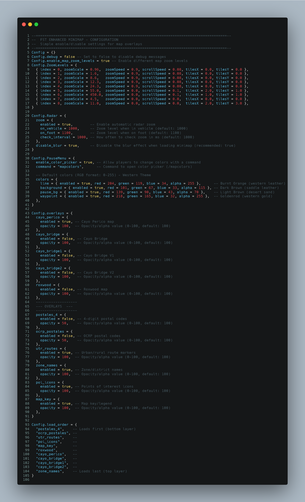

# fst-western-minimap

Forged in Sun. Crowned in Dust.  Golden Suelo is not just a recolor. It’s a fully standalone and customizable FiveM minimap designed to give your server complete visual control.  The base design keeps the original GTA layout while transforming the entire island into a warm western desert style with balanced tones, clean roads, and strong readability. What makes it different? You control everything.  A clean, new design with full customization power.



## **Features**

This is not a static texture pack.

Inside the config, you have full control over how your map looks and behaves:

* Enable or disable <mark style="color:$success;">**zone names**</mark>
* Enable or disable <mark style="color:$success;">**urban & rural route lines**</mark>
* Enable or disable <mark style="color:$success;">**POI icons**</mark>
* Enable or disable the <mark style="color:$success;">**map legend/key**</mark>
* Enable or disable <mark style="color:$success;">**postal overlays**</mark>
* Adjust overlay opacity
* Control overlay load order
* Enable extra maps (Cayo, Roxwood, Bridges)
* Customize pause menu colors
* Control radar zoom behavior

You decide what your players see:

* <mark style="color:$warning;">Minimal clean RP style</mark>
* <mark style="color:$warning;">Full detailed dispatch-style map</mark>
* <mark style="color:$warning;">Desert survival theme</mark>
* <mark style="color:$warning;">High-clarity competitive setup</mark>

Everything is possible directly from the config.

## Visual Design

FST Western Minimap transforms the island with:

* Warm ochre desert tones
* Clean highways that are easy to follow
* Structured southern city grid
* Natural northern desert flow
* Balanced coastline contrast
* Clear rail lines and layered roads

It feels like a golden frontier version of Los Santos — without breaking immersion.

Every detail is tuned for clarity, navigation, and roleplay.

## Requirements


Optional: `ox_lib` (only required if the HUD color picker feature is enabled)


## Config

<figure><figcaption></figcaption></figure>

## Installation

1. Place the resource folder inside your server resources (for example inside a `[fst]` category).
2. Make sure the folder name is exactly `fst_western_minimap`.
3.  Add the resource to your `server.cfg`:

    ```cfg
    ensure fst_western_minimap
    ```
4. (Optional) Install and start `ox_lib` **before** this resource if you want to use the `/mapcolors` HUD color picker.
5. Adjust `config.lua` to your liking (overlays, radar zoom, colors) and restart the resource when done.

## Overlays

Overlay behavior is controlled in `config.lua` and defined in `client/cl_overlays.lua` (escrowed). Each overlay has `enabled` and `opacity` settings, and the draw order is controlled by `Config.load_order`.

Available overlay types:

* **postales\_4** – 4‑digit postal grid overlay.
* **ocrp\_postales** – OCRP‑style postal grid overlay.
* **utr\_routes** – Urban/rural route markers.
* **zone\_names** – Zone/district name labels.
* **poi\_icons** – Points‑of‑interest icon layer.
* **map\_key** – Map legend/key graphic.
* **roxwood** – Roxwood map extension tiles.
* **cayo\_perico** – Cayo Perico island tiles.
* **cayo\_bridge**, **cayo\_bridge1**, **cayo\_bridge2** – Bridge overlays connecting the main map to Cayo Perico.

You can enable or disable any overlay and reorder them in `Config.load_order` to decide which layers appear above others.

## Overlay & Map Support

The minimap supports:

* 4-digit postals
* OCRP postals
* (Planned) additional postal sets
* Urban & rural route systems
* Zone and district names
* POI icon layers
* Map legend
* Cayo Perico
* Cayo bridges (3 versions)
* Roxwood
* Custom overlay load order control

You can stack overlays exactly how you want.
